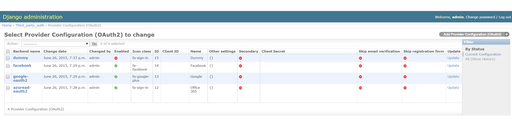
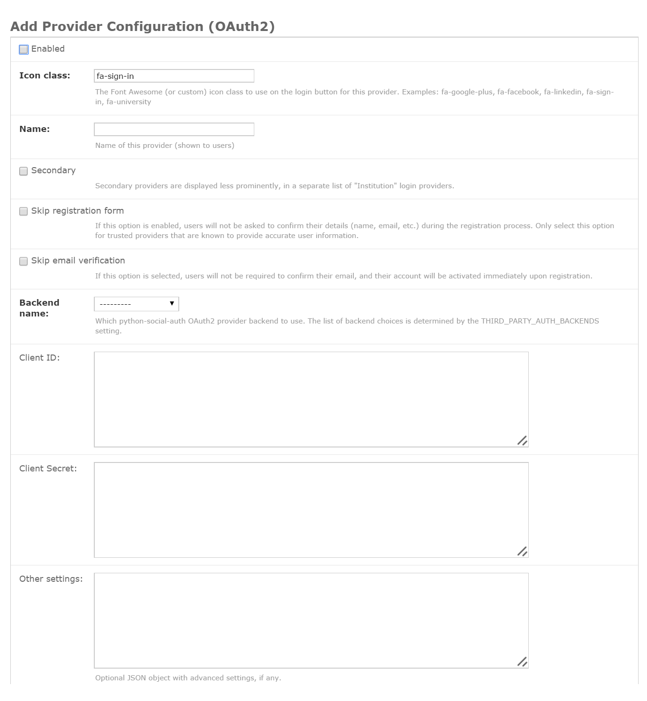
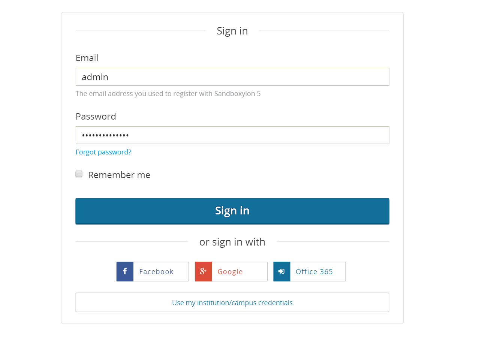
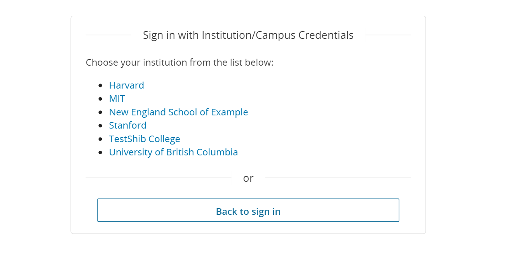

.. include:: ../links.rst

.. _Enable Third Party Auth and Single Sign On:

#################################################################
Enabling Third Party Auth and Single Sign On
#################################################################

.. contents::
   :local:

*****************************************************************
What is Single Sign On (SSO)
*****************************************************************

<TODO>

*****************************************************************
Why SSO?
*****************************************************************

<TODO>

*****************************************************************
How to Set Up SSO in edX
*****************************************************************

Setting up SSO in edX involves 3 main parts. 

=================================================================
Obtaining a Client ID and Secret from the OAuth2 Provider
=================================================================

In order to add a new OAuth2 provider to your edX installation, you will first have to go to the provider's site to register your edX installation with that provider and obtain a client ID and secret for your installation. All Oauth2 providers have well defined interfaces for doing this.

=================================================================
Enabling Third Party Auth
=================================================================

By default, third party auth is not enabled on edX intstallations. To enable it, 

#. Edit the lms.env.json file to set "FEATURES" -> "ENABLE_THIRD_PARTY_AUTH" to "true".

=================================================================
Adding approved providers to the configuration
=================================================================

For security reasons, every installation needs to maintain a "whitelist" of approved OAuth2 providers. To add a new provider to this whitelist,

#. Ensure that the python-social-auth backend class for the provider you want to use is accessible on your edX installation. 

#. Edit the lms.env.json file to add the backend class to "THIRD_PARTY_AUTH_BACKENDS".

=================================================================
Enabling and configuring one of the approved providers
=================================================================

OAuth2 providers from the whitelist can be enabled or disabled using the admin UI.

1. Login to edX as the admin.

2. Go to Third Party Auth -> Provider Config (OAuth2) page.

 

3. Click "Add" to add the provider you want from the dropdown.

4. In the "Add Provider Configuration" dialog, enter the Name, Icon, client ID, secret, and other settings. Note that the  Name and Icon should be as you would like them to appear in the login page UI.

5. Specify the other options such as whether you want to treat the provider as primary or secondary, and, for trusted providers, whether you want to simplify the registration process by skipping the registration form or confirmation email. More details on these options can be found below.

6. Click "Enabled" to enable the provider. (Or you can enable it later after saving.)

#. Click "Save".

At this point, if you go to the LMS login page, you should see the login button for your provider. 

*****************************************************************
Additional Features
*****************************************************************

=================================================================
Secondary providers:
=================================================================

The list of providers enabled for an edX installation can be divided into two categories: Primary and Secondary. Providers from the primary list are displayed prominently on the login / registration pages (with a button). Secondary providers are displayed less prominently, in a separate list of "Institution" login providers.

Here is an example of the signin page for primary providers:

Here is an example of the signin page for secondary providers: 

You can specify whether a provider is Primary or Secondary via the Third Party Auth -> Provider Configuration (OAuth2) admin page.

=================================================================
Skip registration form:
=================================================================

In order to make the registration process simpler, edX makes it possible to simply absorb the user's details (such as name, email etc.) silently from their OAuth2 provider instead of asking them to confirm them. This option should be used only for trusted providers that are known to provide accurate user information.

You can specify whether to skip the registration form on a per-provider basis via the Third Party Auth -> Provider Configuration (OAuth2) page.

=================================================================
Skip email verification: 
=================================================================

At the end of the registation process, edX sends an email to the email address provided during registration to confirm the identity of the user. For trusted providers, the admin can choose to skip this part so users will not be required to confirm their email, and their account will be activated immediately upon registration.

You can specify whether to skip the email verification step during the registation process via the Third Party Auth -> Provider Configuration (OAuth2) page.

=================================================================
Ability to specify default 3rd party auth via QueryString parameter: 
=================================================================

If the link to a course includes a query parameter (tpa_hint) that specifies one of the enabled third party auth providers, and the user is not logged in to that provider, the third party auth sign in flow with the specified provider will be automatically started instead of redirecting the user to the login page.

*****************************************************************
Case Study: Setting Up SSO with Office 365
*****************************************************************

The following sections describe how to add and conffigure Microsoft Office 365 as an OAuth2 provider to edX.

=================================================================
Obtaining a Client ID and Secret from Azure Active Directory
=================================================================

Microsoft Office 365 uses Microsoft Azure Active Directory as the directory and OAuth2 provider for itself. So, in order to add Microsoft Office 365 as a OAuth2 provider to your edX installation, you will need to start with Microsoft Azure Active Directory.

#. You will need an Azure subscription. If you do not have one, you can create one by visiting https://azure.microsoft.com/en-us/pricing/free-trial/. Note: During the setup, you are required to enter a credit card and phone number. If you do not setup virtual machines or use paid services on the subscription, and only use it to access the Azure Active Directory, you will not be charged for the subscription.

#. To use edX with Office 365 for SSO, you must configure Microsoft Azure to manage your Office 365 Microsoft Azure Active Directory:

   #. Login to Azure portal by going to https://manage.windowsazure.com.

   #. Either create a new Active Directory or select an existing one.
   
#. Register an application in Azure

   #. Sign in to the Microsoft Azure Management Portal.

   #. Click on the Active Directory icon on the left menu, and then click on the desired Office 365 connected Azure AD.

   #. On the top menu, click Applications. If no apps have been added to your directory, this page will only show the Add an App link. Click on the link, or alternatively you can click on the Add button on the command bar.

   #. On the What do you want to do page, click on the link to Add an application my organization is developing.

   #. On the Tell us about your application page, you must specify a name for your application and indicate the type of application you are registering with Azure AD. Click web application and/or web API (default) and then click the arrow icon on the bottom-right corner of the page.

   #. On the App properties page, provide the Sign-on URL and App ID URI for your Moodle instance. The Sign-on URI is the Redirect URI for your edX installation. Ensure there is a trailing slash for this URL - e.g. https://example.com/auth/. The APP ID URI is the main URI of the edX installation.

   #. Click the checkbox in the bottom-right hand corner of the page and then click Ok to add your app to Azure Active Directory.

   #. There are a couple more values and changes you need to make and write down some values which you will need in the next section.

#. Configure the application

   #. In the Azure portal, click on the Active Directory icon on the left menu, and then click on the desired Azure AD.

   #. Click the Applications tab at the top of the screen.

   #. Select your app.

   #. Click Configure at the top of the screen.

   #. Locate the Client ID and copy it to the Client ID field in your OpenID connect configuration screen.

   #. To create a Client Secret, locate the keys section and select a duration for the validity of the key. Save the new key and copy it to the Client Secret field in your OpenID connect configuration screen.

   #. OpenID Connect Settings

   #. Locate the Permissions to other applications section.

   #. Click Add application click the plus sign to the right of Office 365 Exchange Online and Office 365 SharePoint Online. Note, the plus will appear when you hover over each of the items.

   #. Click the check mark at the bottom right of the dialog.

   #. In the Delegated Permissions dropdown for Windows Azure Active Directory select the following permissions:

      #. Read directory data

      #. Enable sign-on and read users' profiles

   #. Click save at the bottom of the screen.

#. Add a user to the app

   #. In the Azure portal, click on the Active Directory icon on the left menu, and then click on the desired Azure AD.

   #. Click the Applications tab at the top of the screen.

   #. Select your app.

   #. Click the Users tab at the top of the screen.

   #. Select an Office 365 User to assign to assign to the App.

   #. Click Assign at the bottom of the screen.

   #. When prompted whether you are sure you want to enable access, click Yes.

=================================================================
Enabling Third Party Auth
=================================================================

By default, third party auth is not enabled on edX intstallations. To enable it, 

#. Edit the lms.env.json file to set "FEATURES" -> "ENABLE_THIRD_PARTY_AUTH" to "true".

=================================================================
Adding Azure Active Directory to the List of Approved Providers
=================================================================

For security reasons, every installation needs to maintain a "whitelist" of approved OAuth2 providers. To add Azure Active Directory to this whitelist,

#. Ensure that the azuread-oauth2 backend class is accessible on your edX installation. If you have installed python-social-auth version 0.2.10 or better, then you should already have the class. 

#. Edit the lms.env.json file to add the backend class to "THIRD_PARTY_AUTH_BACKENDS".

=================================================================
Enabling and Configuring Azure Active Directory Provider
=================================================================

1. Login to edX as the admin.

2. Go to Third Party Auth -> Provider Config (OAuth2) page.

 
3. Click "Add" to add the provider you want from the dropdown.

4. In the "Add Provider Configuration" dialog, enter the Name as "Office 365", Icon  as "fa-sign-in", and the Client ID and Secret as those that you obtained earlier.

.. image:: ../Images/add_office365_provider_config.png
 :alt: Image showing the Add Oauth2 provider page with settings for Office 365

5. Specify the other options such as whether you want to treat the provider as primary or secondary, and whether you want to simplify the registration process by skipping the registration form or confirmation email.

6. Click "Enabled" to enable the provider.

#. Click "Save".

At this point, if you go to the LMS login page, you should see the login button for Office 365. 

